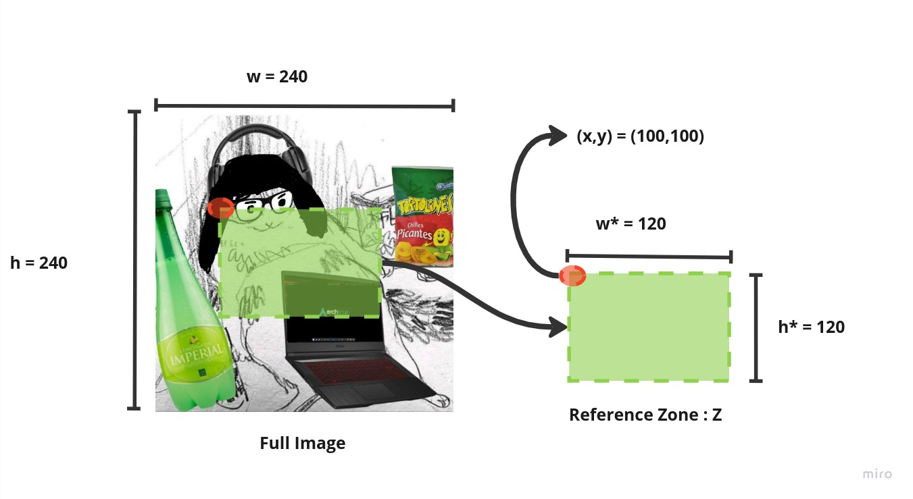
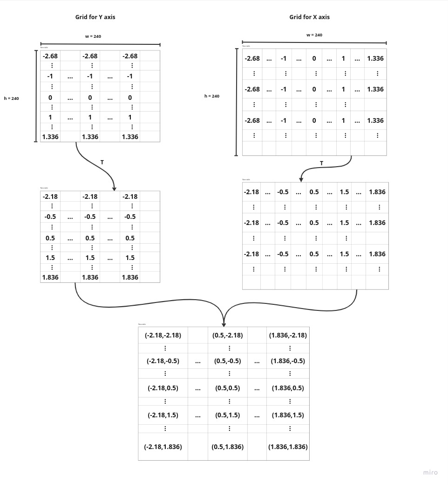
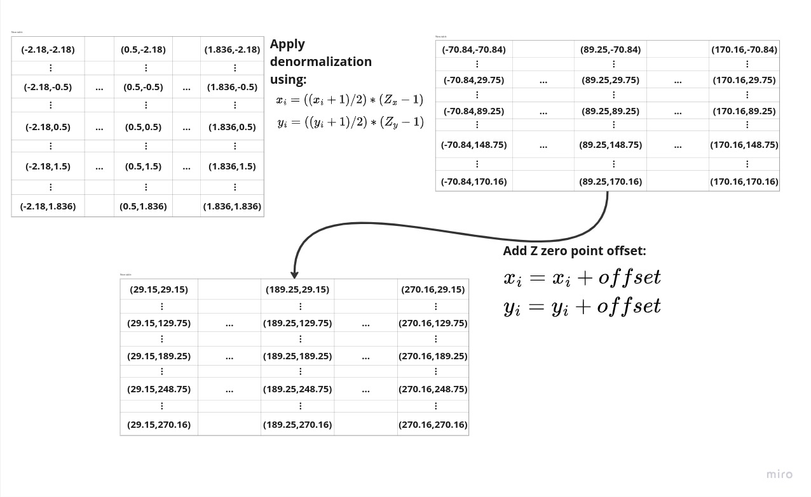

# Description for extended_grid_sample

This is just a detailed description of my proposal to extend the grid_sample from pytorch [here](https://github.com/pytorch/pytorch/issues/100526) plus a simple implementation using numpy.

## Considerations

Let's consider an image with dimensions $w,h$. Now, consider a rectangle within the image with dimensions $w^\*,h^\*$, call it *reference zone* $Z$, hence $w^\*\leq w,h^\*\leq h$. The *reference zone* $Z$ can be positioned at any location in the image with coordinates $x,y$ respectively for the *x* and *y* axis using the top left corner of the rectangle as reference. We can apply a geometric transformation (like homography or affine) $T$ to $Z$ using a sampling grid normalizing the corresponding axis $x\_{axis}=[0,w^\*]$ and $y\_{axis}=[0,h^\*]$ to $[-1,1]$ respectively. That allow us to apply an arbitrary transformation $T$ to an smaller portion of an image and project that transformation directly into a bigger space if needed like as illustrated in the next image.


## Illustrated example 
 
The procedure for this is not that straight forward to understand so let's make a step by step example.


1) Define an image with dimensions $w=240, h=240$ and a zone $Z$ with dimensions $w^\*=120,h^\*=120$ placed at $x=100,y=100$. 



2) Now we can define 2 grids to create our sampling grid. One for the $x_{axis}$ coordinates and one for the $y_{axis}$ coordinates. Both if this grids have the same $w,h$ dimensions as the image and describes a normalize space taking the sequences $[0:w^\*]$ and $[0:h^\*]$ respectively as reference and padding this sequences to accommodate the extra space. Then we can apply our transformation $T$ to this grid and form our final sampling grid.



3) Now that we have the sampling grid we need to denormalize the grid using the dimension of $Z$, also, in this case the $(0,0)$ point of $Z$ is not at $(0,0)$ in the image, instead is placed at $(100,100)$ so we need to add that offset to our calculations. 




4) After that the procedure to calculate the values for the new image is the same as in the [https://github.com/pytorch/pytorch/blob/f064c5aa33483061a48994608d890b968ae53fb5/aten/src/THNN/generic/SpatialGridSamplerBilinear.c#L41](pytorch) `grid_sample` implementation, we only need to keep in consideration the size of the image, that is, our coordinates described by the sampling grid must be between $[0,w]$ for $x$ and $[0,h]$ for $y$. This process yields a result like this:


## Extras

This approach not only allow us to apply differents transformations on smaller portions of an image. This also allow to apply transformations and project them into bigger spaces so we don't lose any information. To do this we only need to add some padding to our grid and take $Z$ match the dimensions of the image and offset zero.


# Runnig examples

The examples that produce the results shown above can be found in the `example1.py` and `example2.py` respectively. Feel free to experiment.

## Dependencies

To run the examples make sure to install:

- Numpy
- Pytorch
- Matplotlib
- scikit-image

## Run the examples

The examples write the results in the `images` folder and shows a plot made with matplotlib

### Transformation on smaller portion

```console
python example1.py
```

### Transformation on bigger space

```console
python example2.py
```